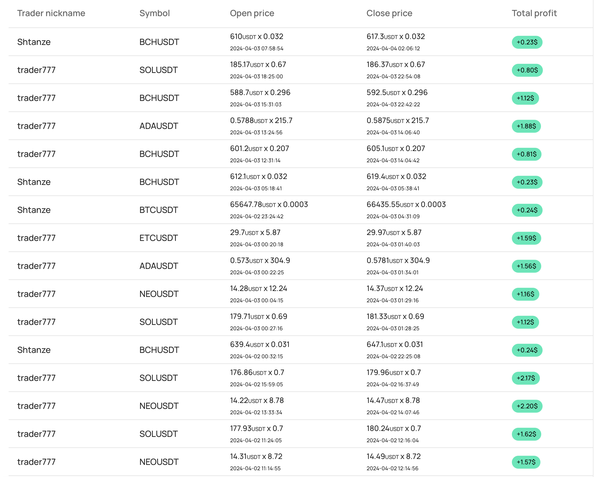

[](https://github.com/AndreyMashukov/go-crypto-bot/actions/workflows/docker-image.yml)
### Go Multithreading Crypto Trading Bot


- Join our Discord server: [Autotrade.cloud - Discord Traders Community](https://discord.gg/eS6tCBCcQ2)
- Try cloud crypto bot: [Autotrade.cloud](https://autotrade.cloud)
> Register and get 10$ for free trial

This is production ready crypto trading bot, supports:
- Classic trading (no margin, long only)
- Triangular arbitrage
- ML (Linear regression on history data) integration
- API access for management system
- Docker support

Supported crypto exchange:
- Binance (ready, well tested)
- ByBit (under development) branch [bybit-api](https://github.com/AndreyMashukov/go-crypto-bot/tree/bybit_implementation)

### Setup 
| Variable  | Description                                                   | Example                                                                                                                                                    |
|-----------|---------------------------------------------------------------|------------------------------------------------------------------------------------------------------------------------------------------------------------|
| BOT_UUID  | Uniq bot UUID (from database table `bot`)                     | 6c26e421-06fd-4c61-84d9-caf36b8966af                                                                                                                       |
| DATABASE_DSN  | MySQL connection string                                       | root:go_crypto_bot@tcp(mysql:3306)/go_crypto_bot                                                                                                           |
| REDIS_DSN  | Redis connection string                                       | redis:6379                                                                                                                                                 |
| REDIS_PASSWORD  | Redis password (can be empty, depends on your infrastructure) | -                                                                                                                                                          |
| BINANCE_API_KEY  | Personal binance API Key                                      | See binance doc: [testnet](https://testnet.binance.vision/), [prod](https://www.binance.com/en/support/faq/how-to-create-api-keys-on-binance-360002502072) |
| BINANCE_API_SECRET  | Personal binance API Secret                                   | See binance doc: [testnet](https://testnet.binance.vision/), [prod](https://www.binance.com/en/support/faq/how-to-create-api-keys-on-binance-360002502072) |
| BINANCE_WS_DSN  | Websocket API Destination URL                                 | testnet `wss://testnet.binance.vision/ws-api/v3` prod `wss://ws-api.binance.com:443/ws-api/v3`                                                             |
| BINANCE_STREAM_DSN  | Websocket Stream (price updates) Destination URL              | testnet `wss://stream.binance.com` prod `wss://stream.binance.com`                                                                                         |

#### For development or testing mode
```bash
cp docker-compose.yaml.dist docker-compose.yaml
```
SETUP your ENV variables in docker-compose.yaml
```bash
docker-compose build --no-cache
docker-compose up mysql
make init-db-dev
```
Connect to database and verify all migrations is executed, you will see one row in database table `bot` with UUID = `6c26e421-06fd-4c61-84d9-caf36b8966af` (you can change it)
> Setup `BOT_UUID` variable in `docker-compose.yaml` and start the Bot
```bash
docker-compose up -d 
docker ps # find your container ID
docker logs -f {container_id} # see logs
```

#### Using Bot API for setting up trading symbols (trade limits) 
UPDATE BOT CONFIG
```bash
curl --location --request PUT 'http://localhost:8090/bot/update?botUuid={BOT_UUID}' \
--header 'Content-Type: application/json' \
--data-raw '{
    "isMasterBot": true,
    "isSwapEnabled": true,
    "tradeStackSorting": "percent",
    "swapConfig": {
      "swapMinPercent": 2.00, 
      "swapOrderProfitTrigger": -5.00, 
      "orderTimeTrigger": 36000, 
      "useSwapCapital": true, 
      "historyInterval": "1d", 
      "historyPeriod": 14
    }
}'
```
**What is Master bot?**
> If you use multiple bots on one machine, you can set one of them as `master bot` - master bot is able to update some extra data which is static and can be used by others bots

**What is swap?**
> We call `SWAP` is triangular arbitrage, if `SWAP` is enabled, bot will try to do triangular arbitrage with negative profit positions (to gain coin amount).
SwapConfig: 
> - `swapMinPercent` - Minimum profit percent for swap
> - `swapOrderProfitTrigger` - Swap will be activated on orders with negative profit from this value
> - `orderTimeTrigger` - Swap will be only activated from this position time
> - `useSwapCapital` - Use swap capital for position profit calculation
> - `historyInterval` - Swap history check interval
> - `historyPeriod` - Swap history check period

CREATE YOUR FIRST TRADE LIMIT (Symbol) `PERPUSDT`
```bash
curl --location --request POST 'http://localhost:8090/trade/limit/create?botUuid={BOT_UUID}' \
--header 'Content-Type: application/json' \
--data-raw '{
        "symbol": "PERPUSDT",
        "USDTLimit": 100,
        "minPrice": 0.00001,
        "minQuantity": 0.01,
        "minNotional": 5,
        "isEnabled": true,
        "USDTExtraBudget": 80,
        "buyOnFallPercent": -3.5,
        "minPriceMinutesPeriod": 200,
        "frameInterval": "2h",
        "framePeriod": 20,
        "buyPriceHistoryCheckInterval": "1d",
        "buyPriceHistoryCheckPeriod": 14,
        "profitOptions": [
            {
                "index": 0,
                "optionValue": 1,
                "optionUnit": "h",
                "optionPercent": 2.40,
                "isTriggerOption": true
            }
        ],
        "extraChargeOptions": [
            {
                "index": 0,
                "percent": -4.50,
                "amountUsdt": 20.00
            }
        ],
        "profitOptions": [
            {
                "index": 0,
                "isTriggerOption": false,
                "optionValue": 30,
                "optionUnit": "i",
                "optionPercent": 1.50
            }
        ],
        "tradeFiltersBuy" : [],
        "tradeFiltersSell": [],
        "tradeFiltersExtraCharge": []
}'
```
UPDATING TRADE LIMIT FOR `PERPUSDT`
```bash
curl --location --request PUT 'http://localhost:8090/trade/limit/update?botUuid={BOT_UUID}' \
--header 'Content-Type: application/json' \
--data-raw '{
        "symbol": "PERPUSDT",
        "USDTLimit": 100,
        "minPrice": 0.00001,
        "minQuantity": 0.01,
        "minNotional": 5,
        "isEnabled": true,
        "USDTExtraBudget": 80,
        "buyOnFallPercent": -3.5,
        "minPriceMinutesPeriod": 200,
        "frameInterval": "2h",
        "framePeriod": 20,
        "buyPriceHistoryCheckInterval": "1d",
        "buyPriceHistoryCheckPeriod": 14,
        "profitOptions": [
            {
                "index": 0,
                "optionValue": 1,
                "optionUnit": "h",
                "optionPercent": 2.40,
                "isTriggerOption": true
            }
        ],
        "extraChargeOptions": [
            {
                "index": 0,
                "percent": -4.50,
                "amountUsdt": 20.00
            }
        ],
        "profitOptions": [
            {
                "index": 0,
                "isTriggerOption": false,
                "optionValue": 30,
                "optionUnit": "i",
                "optionPercent": 1.50
            }
        ],
        "tradeFiltersBuy" : [
          {
              "symbol": "BTCUSDT",
              "parameter": "price",
              "condition": "lt", // lt|gt|lte|gte|eq|neq
              "value": "50000.00",
              "type": "or", // or|and
              "children": []
          }
        ],
        "tradeFiltersSell": [],
        "tradeFiltersExtraCharge": []
}'
```
GETTING TRADE LIMIT LIST `ALL`
```bash
curl --location --request GET 'http://localhost:8090/trade/limit/list?botUuid={BOT_UUID}'
```
GETTING TRADE STACK
```bash
curl --location --request GET 'http://localhost:8090/trade/stack?botUuid={BOT_UUID}'
```
GETTING OPENED POSITION LIST
```bash
curl --location --request GET 'http://localhost:8090/order/position/list?botUuid={BOT_UUID}'
```
GETTING PENDING POSITION LIST (Current limit orders for BUY)
```bash
curl --location --request GET 'http://localhost:8090/order/pending/list?botUuid={BOT_UUID}'
```
UPDATING EXTRA CHARGE CONFIGURATION FOR OPENED POSITION (Order)
```bash
curl --location --request PUT 'http://localhost:8090/order/extra/charge/update?botUuid={BOT_UUID}' \
--header 'Content-Type: application/json' \
--data-raw '{
    "orderId": 92,
    "extraChargeOptions": [
        {
            "index": 3,
            "percent": -14.50,
            "amountUsdt": 120.00
        },
        {
            "index": 2,
            "percent": -4.00,
            "amountUsdt": 10.00
        },
        {
            "index": 1,
            "percent": -2.00,
            "amountUsdt": 30.00
        },
        {
            "index": 0,
            "percent": -1.0,
            "amountUsdt": 30.00
        }
    ]
}'
```
GETTING CHART FOR TRADE LIMITS (Symbols)
```bash
curl --location --request GET 'http://localhost:8090/chart/list?botUuid={BOT_UUID}'
```
GETTING HEALTH CHECK
```bash
curl --location --request GET 'http://localhost:8090/health/check?botUuid={BOT_UUID}'
```
#### 

### Docker image
For production you can use docker image [amashukov/go-crypto-bot:latest](https://hub.docker.com/r/amashukov/go-crypto-bot/tags)
```bash
docker pull amashukov/go-crypto-bot:latest
```
Do not forget to set [env variables](https://github.com/AndreyMashukov/go-crypto-bot?tab=readme-ov-file#setup) for started container
### Donation:
USDT (TRC-20) address `TTdHsHxfPUxdcn3wJ3o9hGAKF2Te7epM46`
