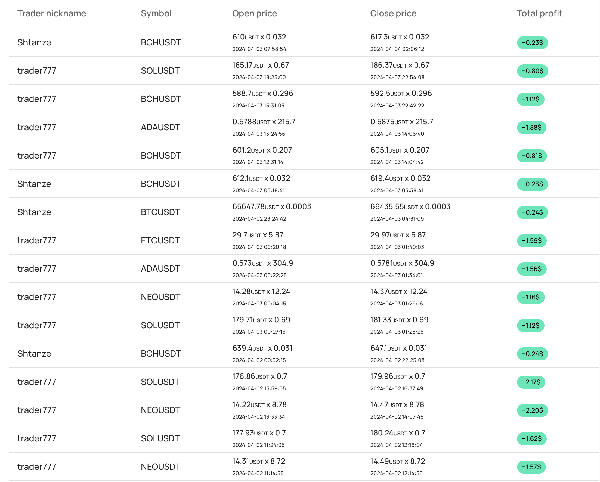

# go-crypto-bot

[](https://github.com/AndreyMashukov/go-crypto-bot/actions/workflows/docker-image.yml)
[](LICENSE)

Production-ready Go trading engine for Binance and ByBit. Concurrent
multi-symbol execution, triangular arbitrage, ML-driven signals, full HTTP
API for management.



- Community: [Autotrade.cloud Discord](https://discord.gg/eS6tCBCcQ2)
- Hosted version: [autotrade.cloud](https://autotrade.cloud) — $10 trial on signup.

---

## What's in this repo

| Layer | Path | README |
|---|---|---|
| Trading engine (Go module) | `server/` | [server/README.md](server/README.md) |
| Dev stack (docker-compose, ClickHouse config, base image) | `.docker/`, `docker-compose.yaml.dist` | — |
| Lint, hooks, lint config | `.githooks/`, `.golangci.yml` | — |

Each layer keeps its own deep documentation; this top-level README is just
the orientation page.

---

## Quick start

Pull the prebuilt image:

```bash
docker pull amashukov/go-crypto-bot:latest
```

Or run the full dev stack locally:

```bash
cp docker-compose.yaml.dist docker-compose.yaml
# fill BINANCE_API_KEY / BINANCE_API_SECRET in docker-compose.yaml

docker-compose build --no-cache
docker-compose up -d mysql redis clickhouse
make init-db-dev          # apply MySQL migrations
docker-compose up -d writer
docker logs -f go_crypto_bot
```

After migrations the `bot` table has one row with UUID
`6c26e421-06fd-4c61-84d9-caf36b8966af` — change it or set `BOT_UUID` to
match.

Full configuration reference, HTTP API, and development workflow live in
[`server/README.md`](server/README.md).

---

## Features

- **Spot trading** (long-only) with per-symbol limits, multi-step profit
  options, extra-charge ladders, rule-based buy/sell filters.
- **Triangular arbitrage** (`SWAP`) — rescues negative-PnL positions via
  3-leg circular trades.
- **ML signals** — linear regression on history, retrains automatically;
  embedded CPython via cgo.
- **Multi-exchange** — Binance (production), ByBit (beta).
- **Multi-tenant** — one container per bot UUID; many bots share
  Redis/MySQL/ClickHouse on one host.
- **REST + WebSocket** — `:8090` HTTP control plane plus live WS market
  feeds.

---

## Quality gates

`make hooks` activates a blocking pre-commit hook:

1. `gofmt -l` on staged files
2. `go vet ./...`
3. `go build ./...`
4. `golangci-lint run --new-from-rev=HEAD` (24 linters)
5. `go-lint ./...` — AST analyzers from
   [github.com/AndreyMashukov/go-lint](https://github.com/AndreyMashukov/go-lint)
6. Source-without-test pairing
7. `go test` on touched packages

Rename-only commits short-circuit content checks. No `--no-verify` bypass.

---

## License

MIT — see [LICENSE](LICENSE).

## Donations

USDT (TRC-20): `TTdHsHxfPUxdcn3wJ3o9hGAKF2Te7epM46`
